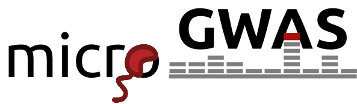

Welcome to microGWAS's documentation!
==========================================

**microGWAS** is a snakemake-powered pipeline to carry out
an end-to-end microbial GWAS analysis.
Starting from genome assemblies and a phenotype file, microGWAS
will run a number of single-locus and whole genome associations
using ``pyseer``, and annotate the associations results, as well
as generating a number of functional enrichment tests.

Citation
--------

If you find the ``microGWAS`` pipeline useful, please cite it as:

.. code-block:: console

    Burgaya, J., Damaris, B. F., Fiebig, J., & Galardini, M. (2025).
    microGWAS: a computational pipeline to perform large-scale bacterial genome-wide association studies. Microbial Genomics, 11(2), 001349.

Please also consider citing the underlying tools used by the pipeline.
See :doc:`tools` for more details.

Contents
--------

.. toctree::

   inputs
   usage
   tutorial
   outputs
   rules
   tools
