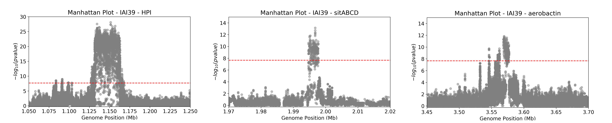

Beginner's guide
================

This guide will walk you through conducting a comprehensive GWAS analysis on 370 *Escherichia coli* strains using the ``microGWAS`` pipeline. 
In the `study by Galardini et al. (2020) <https://journals.plos.org/plosgenetics/article?id=10.1371/journal.pgen.1009065>`_ , a mouse model of sepsis was used to characterize the virulence phenotype of the strains.
By using ``microGWAS`` in this tutorial, you will uncover genetic variants (unitigs, gene presence/absence, rare variants, gene cluster specific k-mers) associated with this virulence phenotype.

Prerequisites
----------------

- Basic command-line knowledge
- Familiarity with genomic data 
- A computer with at least 10 GB RAM with 8 cores with a Linux operating system like Ubuntu

The whole tutorial will take at least 24 hours to complete.

1. Before you begin
--------------------

i. Install Conda (if not already installed):
^^^^^^^^^^^^^^^^^^^^^^^^^^^^^^^^^^^^^^^^^^^^

   If you don't have Conda installed, you can install it via Miniconda. Miniconda is a minimal installer for Conda.

   a. Download the Miniconda installer:

   .. code-block:: console

      wget https://repo.anaconda.com/miniconda/Miniconda3-latest-Linux-x86_64.sh -O miniconda.sh

   b. Install Miniconda:

   .. code-block:: console

      bash miniconda.sh -b -p $HOME/miniconda

   c. Initialize Conda:

   .. code-block:: console

      eval "$($HOME/miniconda/bin/conda shell.bash hook)"

   d. Verify the installation:

   .. code-block:: console

      conda --version

   You should see the Conda version printed to the console.

ii. Install mamba (if not already installed):
^^^^^^^^^^^^^^^^^^^^^^^^^^^^^^^^^^^^^^^^^^^^^^

After installing Conda, we recommend installing Mamba, a faster alternative to Conda for package management. 
Mamba is the recommended way of using Snakemake's conda integration.

   a. Install mamba in your base conda environment

   .. code-block:: console

      conda install -n base -c conda-forge mamba

   b. Verify the mamba installation 

   .. code-block:: console

      mamba --version
   
   You should see the mamba version printed to the console.

iii. Installing ``microGWAS``:
^^^^^^^^^^^^^^^^^^^^^^^^^^^^^^

We recommend obtaining ``microGWAS`` by downloading the latest release from GitHub:

* Visit the `releases page <https://github.com/microbial-pangenomes-lab/microGWAS/releases>`_ on GitHub. 

* Download the ``microGWAS.tar.gz`` file from the latest available release.
   
* Unpack the downloaded file (``tar -xvf microGWAS.tar.gz``).

* Navigate to the unpacked directory (``cd microGWAS``)

Additional install methods are listed in the :doc:`Usage page </usage>`.

iv. Set up the ``microGWAS`` conda environment (if not present already):
^^^^^^^^^^^^^^^^^^^^^^^^^^^^^^^^^^^^^^^^^^^^^^^^^^^^^^^^^^^^^^^^^^^^^^^^

   Add the following channels:

   .. code-block:: console

      conda config --add channels defaults
      conda config --add channels bioconda
      conda config --add channels conda-forge  

   Now, create and activate the microGWAS conda environment:

   .. code-block:: console

      conda env create -f environment.yml
      conda activate microGWAS

v. Prepare your input data:
^^^^^^^^^^^^^^^^^^^^^^^^^^^^

a. Create a directory structure for your input files:

   .. code-block:: console

      mkdir -p data/gffs data/fastas

b. Download sample genomes in ``GFF`` format:

   .. code-block:: console
   
      wget -O data/gff.tar.gz https://figshare.com/ndownloader/files/34723351
   
   Extract GFF files:

   .. code-block:: console

      tar -xzvf data/gff.tar.gz --strip-components=1 -C data/gffs/

c. Download sample genomes in ``FASTA`` format:

   .. code-block:: console
   
      wget -O data/genomes.tgz https://figshare.com/ndownloader/files/21781689
   
   Extract genome FASTA files:

   .. code-block:: console

      tar -xzvf data/genomes.tgz -C data/fastas/

d. Download and modify the phenotype data:

   .. code-block:: console

      wget https://raw.githubusercontent.com/mgalardini/2018_ecoli_pathogenicity/master/data/phenotypes/phenotypes.tsv -O data/data.tsv

   The phenotype file contains two reference strains, "ED1a" and "IAI39". These strains should not be included in the phenotype file as they will cause conflicts within the pipeline.
   To remove these strains from you phenotype file, do the following:

   .. code-block:: console 

      sed -i '/^ED1a/d; /^IAI39/d' data/data.tsv

   The following command will update your ``data/data.tsv`` file, adding the paths for fasta and gff files.

   .. code-block:: console

      awk 'BEGIN {OFS="\t"}
      
      NR==1 {print "strain", "fasta", "gff", "phenotype"}
      
      NR>1 {print $1, "data/fastas/" $1 ".fasta", "data/gffs/" $1 ".gff", $3}' data/data.tsv > temp_file &&
      
      mv temp_file data/data.tsv
      
e. Verify the updated phenotype file:

   .. code-block:: console

      head -n 5 data/data.tsv

   You should see an output similar to the example below. The first column lists the sample IDs, the next two columns are the relative paths
   to the assemblies in the fasta and gff formats, respectively. The last column represents the phenotype: where 1 indicates that the strain is virulent, 
   while 0 indicates the strain is avirulent.

   .. code-block:: none

      strain  fasta   gff     phenotype
      ECOR-01 data/fastas/ECOR-01.fasta       data/gffs/ECOR-01.gff   0
      ECOR-02 data/fastas/ECOR-02.fasta       data/gffs/ECOR-02.gff   1
      ECOR-03 data/fastas/ECOR-03.fasta       data/gffs/ECOR-03.gff   0
      ECOR-04 data/fastas/ECOR-04.fasta       data/gffs/ECOR-04.gff   0

f. Clean up:
   
   Remove the compressed files, you do not need them anymore:

   .. code-block:: console

      rm data/gff.tar.gz data/genomes.tgz

g. Verify your directory structure:
   
  After executing the aforementioned steps, your directory structure should look something like this:

   .. code-block:: none

      data/
      ├── data.tsv
      ├──fastas/
      │   ├── genome1.fasta
      │   ├── genome2.fasta
      │   └── ...
      ├── gffs/
      │   ├── genome1.gff
      │   ├── genome2.gff
      │   └── ...

You can confirm by doing:

   .. code-block:: console

      ls data/

vi. Set up the environment and configure the pipeline:
^^^^^^^^^^^^^^^^^^^^^^^^^^^^^^^^^^^^^^^^^^^^^^^^^^^^^^^

a. Set up the eggnog-mapper database:

The ``microGWAS`` pipeline requires the eggnog database for functional annotation. You have two options:

i. If you have an existing eggnog database:
Create a symbolic link to your actual eggnog data directory. 

   .. code-block:: console

      ln -s /storage/miniconda3/envs/eggnog-mapper/lib/python3.9/site-packages/data/ data/eggnog-mapper

Remember  to replace ``/storage/miniconda3/envs/eggnog-mapper/lib/python3.9/site-packages/data/`` with the actual path on your system.

ii. If you do not have the eggnog database:

Simply proceed to run the ``microGWAS`` pipeline. The pipeline will automatically download and setup the required eggnog database during its execution.

.. note::
    Creating a symbolic link is only necessary if you're using an existing eggNOG database.
    This might be preferred as the final database size is more than 50Gb; it therefore makes sense to
    setup this database once and link it in each ``microGWAS`` analysis you are carrying out.

b. Configure the pipeline:

   Ensure that the  ``##### params #####`` section of the ``config/config.yaml`` file matches the print out below.

   .. code-block:: yaml

      targets: [
         "phenotype",
      ]
      
      # MLST scheme
      mlst_scheme: ecoli

      # references for association summaries and annotation
      summary_references: "--reference 536 --reference CFT073 --reference ED1a --reference IAI1 --reference IAI39 --reference K-12_substr._MG1655 --reference UMN026 --reference UTI89"
      annotation_references: "--focus-strain 536 --focus-strain CFT073 --focus-strain ED1a --focus-strain IAI1 --focus-strain IAI39 --focus-strain K-12_substr._MG1655 --focus-strain UMN026 --focus-strain UTI89"
      enrichment_reference: "IAI39"
      
      # species to be used for AMR and virulence predictions
      species_amr: "Escherichia"

2. Running the ``microGWAS`` pipeline
-------------------------------------

Run the bootsrapping script.

   .. code-block:: console

      bash bootstrap.sh Escherichia coli IAI39 GCF_000013305.1,GCF_000007445.1,GCF_000026305.1,GCF_000026265.1,GCF_000026345.1,GCF_000005845.2,GCF_000026325.1,GCF_000013265.1 

This script populates the input files used for the analysis and downloads the relevant reference genomes necessary for annotating the hits for *Escherichia coli* and analyse the variants associated to the phenotype. The syntax for this script is ``bash bootstrap.sh GENUS SPECIES MAINREFERENCE REFSEQID1,[...],REFSEQIDn``, where ``REFSEQID`` indicates the NCBI assembly ID of the various reference genomes to be used in the analysis, and ``MAINREFERENCE`` the name of the main reference genome.

To run the full analysis, use the following command.

   .. code-block:: console

      snakemake -p annotate_summary find_amr_vag manhattan_plots heritability enrichment_plots qq_plots tree --cores 24 --use-conda --conda-frontend mamba

This will:

- Run the GWAS analysis to identify and annotate genetic variants that are associated with the virulence phenotype (``annotate_summary``) 
- Generate a phylogenetic tree of all isolates and the selected references (``tree``)
- Identify antimicrobial resistant and virulence associated genes (``find_amr_vag``)
- Perform an enrichment analysis for the genes with the associated variants, and plot the results (``enrichment_plots``)
- Compute the heritability of the phenotype, determined by the genetic variants and the lineage (``heritability``)
- Generate QQ-plots to diagnose the association analysis (``qq_plots``)
- Generate manhattan plots on the unitigs mapped to a reference (``manhattan_plots``)

The analysis will be parallelized using up to 24 cores (``--cores 24``), and the
necessary tools will be installed in separated conda environments (``--use-conda --conda-frontend mamba``).
The whole process will likely take more than 24 hours.

.. note::
   Change the ``--cores`` argument to indicate what is the maximum number
   of cores that can be used to parallelize the analysis

Customizing your analysis
^^^^^^^^^^^^^^^^^^^^^^^^^^

You can specify which :doc:`rules` you want the pipeline to run. For example, to run the pipeline without generating a phylogenetic tree:

   .. code-block:: console

      snakemake -p annotate_summary manhattan_plots heritability enrichment_plots qq_plots --cores 24 --use-conda --conda-frontend mamba

This command runs all the same analyses as before, except for generating the phylogenetic tree and
identifying AMR and virulence associated genes.

3. Understanding the results
----------------------------
 
``microGWAS`` generates multiple output files and figures which can be accessed from within the ``out/`` directory. For a detailed descripition of all the outputs, refer to :doc:`outputs` section of this documentation. 
For the purpose of this tutorial, we will focus on key results replicated from the  `Galardini et al. (2020) study <https://journals.plos.org/plosgenetics/article?id=10.1371/journal.pgen.1009065>`_

a. Unitig-based association analysis
^^^^^^^^^^^^^^^^^^^^^^^^^^^^^^^^^^^^
Unitigs are unique DNA sequences that serve as markers for genetic variation. ``microGWAS`` uses unitigs with a minimum allele frequency (MAF) of > 1%.

.. image:: ../images/manhattan.png
   :alt:  Manhattan plot of the associated variants
   :align: center

This Manhattan plot shows unitigs associated with virulence. Peaks above the red dashed line represent genomic regions strongly associated with  the virulence phenotype. 
These unitigs are related to three iron-uptake systems: the high-pathogenecity island (HPI), aerobactin, and the *sitABCD* operon.

For a closer look at specific genomic regions of interest related to virulence factors in *E. coli*, you can generate zoomed-in Manhattan plots.
The focus will be on three key areas: the high pathogencity island (HPI), the aerobactin siderophore system, and the *sitABCD* iron transport operon. 
To created these detailed plots, run the following command first:

    .. code-block:: console
        
        python3 workflow/scripts/count_patterns.py out/associations/phenotype/unitigs_patterns.txt --threshold

This command uses the number of unique unitigs' presence/absence patterns to derive an appropriate p-value threshold.
You should obtain a value of ``2.16E-08``. You can then run the script to generate the manhattan plots for the three
regions of interest:

    .. code-block:: console

        python3 workflow/scripts/manhattan_plot.py out/associations/phenotype/mapped_all.tsv IAI39 HPI.png --threshold 2.16E-08 --zoom HPI 1.05 1.25 30
        python3 workflow/scripts/manhattan_plot.py out/associations/phenotype/mapped_all.tsv IAI39 sitABCD.png --threshold 2.16E-08 --zoom sitABCD 1.95 2.05 15
        python3 workflow/scripts/manhattan_plot.py out/associations/phenotype/mapped_all.tsv IAI39 aerobactin.png --threshold 2.16E-08 --zoom aerobactin 3.4 3.8 15

.. note::
   Run ``python3 workflow/scripts/manhattan_plot.py -h`` for an explanation of the syntax used by this script

The plot was generated for the "IAI39" reference genome, and the zoomed-in views were based on the genomic positions of the regions of interest.

You can also generate volcano plots to visualise the statistical significance and magnitute of the effect for the tested genetic variants.
The following code will generate a volcano plots using the ``annotate_summary.tsv`` file, which contains the summary statistics
and gene annotation for the unitigs association analysis.

    .. code-block:: console
        
        python3 workflow/scripts/volcano_plot.py out/associations/phenotype/annotated_summary.tsv volcano.png --threshold 2.16E-08 --genes fyuA sitA iucC
      

This plot represents associations using unitigs as the genetic markers.

.. image:: ../images/volcano.png
   :alt:  A volcano plot of the associated variants.
   :align: center

Each point represents a specific gene. The highlighted genes belong to the high pathogenecity island, the aerobactin, and the *sitABCD* operon.
The x-axis represents the average beta value (effect size), which indicates the magnitude and direction of the association between the unitigs and the virulence phenotye. Points on the right
indicate positive associations and those on the left indicate negative associations. The y-axis shows the statistical significance. The red dashed horizontal line indicates the signficance 
threshold computed using the ``unitigs_patterns.txt`` file.

Similar plots can be created using ``annotated_gpa_summary.tsv`` or ``annotated_panfeed_summary.tsv``. 

b. Gene cluster-specific k-mer association analysis 
^^^^^^^^^^^^^^^^^^^^^^^^^^^^^^^^^^^^^^^^^^^^^^^^^^^
This analysis links specific k-mers to their source genes, using ``panfeed``.

.. image:: ../images/panfeed.png
   :alt:  Associations plots for gene cluster specific k-mers.
   :align: center

These plots represent association  for gene cluster specific k-mers for *fyuA*, *iucC*, and *sitA* genes. The y-axis represents each isolate and the x-axis the k-mer positions relative to the gene start codon for each strain. 
The colors correspond to the -log10 of the association p-value. The dark gray regions imply that the isolates do not encode for the k-mers, while the light gray regions represent k-mers under the association threshold.

c. Functional enrichment analysis
^^^^^^^^^^^^^^^^^^^^^^^^^^^^^^^^^^
This analysis identified overrepresented functional categories among genes with associated variants. 

The plot shows enrichment of clusters of orthologous groups (COG) categories. 
The y-axis of the plot represents each COG catergory, and x-axis the number of gene hits belonging to each category. The bars are colored based on the  -log10 of the enrichment corrected p-value. Bars colored in grey do not have a significant enrichment.

d. Other outputs
^^^^^^^^^^^^^^^^

More information about the results of the association analysis can be found within the ``out`` directory. The content of each folder/file
is reported in the :doc:`outputs` section.

4. Troubleshooting
-------------------

If you have persistent issues, please consult the ``Troubleshooting`` :doc:`usage` guide or seek help in the `project's issue tracker <https://github.com/microbial-pangenomes-lab/microGWAS/issues>`_.
