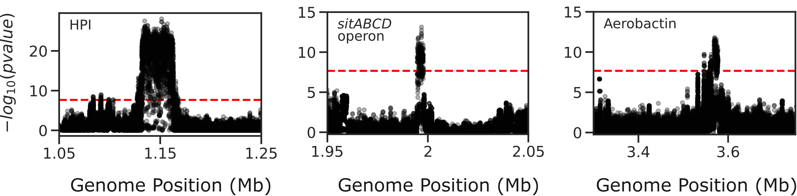

Beginner's guide
================

Genome-wide association study (GWAS) is a power test in bacterial genomics that allows one to identify genetic variants associated with a specific phenotype(s). 
This guide will walk you through conducting a comprehensive GWAS analysis on 370 *Escherichia coli* strains using the ``microGWAS`` pipeline. 
In the `study by Galardini et al. (2020) <https://journals.plos.org/plosgenetics/article?id=10.1371/journal.pgen.1009065>`_ , a mouse model of sepsis was used to characterize the virulence phenotype of the strains.
By following these steps, you will uncover genetic variants (unitigs, gene presence/absence, rare variants , gene cluster specific k-mers)  associated with the virulence phenotype in *Escherichia coli*.

Prerequisites
----------------
- Basic command-line knowledge
- Familiarity with genomic data 
- A computer with at least 10 GB RAM with 8 cores
- Estimated time (*TBD*)

Before you begin
----------------

1. Install Conda (if NOT already installed):
^^^^^^^^^^^^^^^^^^^^^^^^^^^^^^^^^^^^^^^^^^^^

   If you don't have Conda installed, you can install it via Miniconda. Miniconda is a minimal installer for Conda.

   a. Download the Miniconda installer:

      For Linux:

      .. code-block:: console

         wget https://repo.anaconda.com/miniconda/Miniconda3-latest-Linux-x86_64.sh -O miniconda.sh

      For macOS:

      .. code-block:: console

         wget https://repo.anaconda.com/miniconda/Miniconda3-latest-MacOSX-x86_64.sh -O miniconda.sh

   b. Install Miniconda:

      .. code-block:: console

         bash miniconda.sh -b -p $HOME/miniconda

   c. Initialize Conda:

      .. code-block:: console

         eval "$($HOME/miniconda/bin/conda shell.bash hook)"

   d. Verify the installation:

      .. code-block:: console

         conda --version

   You should see the Conda version printed to the console.

2. Clone the repository using ``git``:
^^^^^^^^^^^^^^^^^^^^^^^^^^^^^^^^^^^^^^^

   .. code-block:: console

      git clone --recursive https://github.com/microbial-pangenomes-lab/microGWAS.git microGWAS
      cd microGWAS

   Note: The ``--recursive`` flag is used to clone any submodules that the repository might have.

3. Set up the conda environment:
^^^^^^^^^^^^^^^^^^^^^^^^^^^^^^^^

   First, add the necessary channels:

   .. code-block:: console

      conda config --add channels defaults
      conda config --add channels bioconda
      conda config --add channels conda-forge  

   Now, create and activate the microGWAS conda environment:

   .. code-block:: console

      conda env create -f environment.yml
      conda activate microGWAS

4. Prepare your input data:
^^^^^^^^^^^^^^^^^^^^^^^^^^^

a. Create a directory structure for your input files:

   .. code-block:: console

      mkdir -p data/gffs data/fastas

b. Download sample genomes in ``GFF`` format:

   .. code-block:: console
   
      wget -O data/gff.tar.gz https://figshare.com/ndownloader/files/34723351
   
   Extract GFF files:

   .. code-block:: console

      tar -xzvf data/gff.tar.gz -C data/gffs/

c. Download sample genomes in ``FASTA`` format:

   .. code-block:: console
   
      wget -O data/genomes.tgz https://figshare.com/ndownloader/files/21781689
   
   Extract genome FASTA files:

   .. code-block:: console

      tar -xzvf data/genomes.tgz -C data/fastas/

d. Verify your directory structure:
   
   After extraction, you should have a directory structure that looks like this:

   .. code-block:: none

      data/
      ├── fastas/
      │   ├── genome1.fasta
      │   ├── genome2.fasta
      │   └── ...
      ├── gffs/
      │   ├── genome1.gff
      │   ├── genome2.gff
      │   └── ...
      ├── data.tsv
      ├── gff.tar.gz
      └── genomes.tgz

e. Clean up:
   
   Remove the compressed files if you don't need them anymore:

   .. code-block:: console

      rm data/gff.tar.gz data/genomes.tgz

f. Download and modify the phenotype data:

      .. code-block:: console

         wget https://raw.githubusercontent.com/mgalardini/2018_ecoli_pathogenicity/master/data/phenotypes/phenotypes.tsv -O data/data.tsv
   
We need to add columns for the FASTA and GFF file paths and reorder them. Run the following commands:

.. code-block:: console

   We need a code to enable the user to modify their phentoype file to match the printed output. Perhaps some few bash commands?
Verify the updated phenotype file:

.. code-block:: console

   head -n 5 data/updated_data.tsv

You should see output similar to this:

.. code-block:: none

   strain  fasta   gff     killed  phenotype
   ECOR-01 data/fastas/ECOR-01.fasta       data/gffs/ECOR-01.gff   0       0
   ECOR-02 data/fastas/ECOR-02.fasta       data/gffs/ECOR-02.gff   10      1
   ECOR-03 data/fastas/ECOR-03.fasta       data/gffs/ECOR-03.gff   0       0
   ECOR-04 data/fastas/ECOR-04.fasta       data/gffs/ECOR-04.gff   0       0   

5. Set up the environment and configure the pipeline:
^^^^^^^^^^^^^^^^^^^^^^^^^^^^^^^^^^^^^^^^^^^^^^^^^^^^^

a. Set up the eggnog-mapper database:

   If you have already downloaded the ``eggnog-db``:
   
   Create a symbolic link for the directory where the eggnog-mapper databases are located:

   .. code-block:: console

      ln -s /fast-storage/miniconda3/envs/eggnog-mapper/lib/python3.9/site-packages/data/ data/eggnog-mapper

   If you have not downloaded the ``eggnog-db``:
   
   Run the following command to download the eggnog-db:

   .. code-block:: console

      snakemake -p data/eggnog-mapper/eggnog.db --cores 8 --use-conda --conda-frontend mamba

   After the download is complete, create the symbolic link as shown above.

b. Configure the pipeline:

   Edit the ``config/config.yaml`` file. In the ``##### params #####`` section, uncomment and adjust the following parameters:

   .. code-block:: yaml

      targets: [
         "phenotype",
         #"phenotype2",
      ]
      
      # MLST scheme
      mlst_scheme: ecoli

      # references for association summaries and annotation
      summary_references: "--reference 536 --reference CFT073 --reference ED1a --reference IAI1 --reference IAI39 --reference K-12_substr._MG1655 --reference UMN026 --reference UTI89"
      annotation_references: "--focus-strain 536 --focus-strain CFT073 --focus-strain ED1a --focus-strain IAI1 --focus-strain IAI39 --focus-strain K-12_substr._MG1655 --focus-strain UMN026 --focus-strain UTI89"
      enrichment_reference: "IAI39"
      
      # species to be used for AMR and virulence predictions
      species_amr: "Escherichia"

   Note: These parameters are initially commented out in the file. You need to uncomment them (remove the '#' at the start of each line) and adjust as necessary for your analysis.

Running the microGWAS pipeline
------------------------------

Run the bootsrapping script.

.. code-block:: console

    bash bootstrap.sh Escherichia coli IAI39 

This script populates the input files used for the analysis and downloads the relevant reference genomes necessary for annotating the hits for *Escherichia coli* and analyse the variants

To run the full analysis, use the following command.

.. code-block:: console

    snakemake -p annotate_summary find_amr_vag map_back manhattan_plots heritability enrichment_plots qq_plots tree --cores 24 --verbose --use-conda --conda-frontend mamba

This will:

- Run the GWAS analysis
- Annotate the GWAS results with biological and functional information.
- Identify antimicrobial resistant and virulence associated genes.
- Perform an enrichment analysis for the genes with the associated variants.
- Compute the heritability of the phenotype. 
- Generate visualization plots. 

Customizing your analysis
-------------------------

You also have specify which :doc:`rules` you want the pipeline to run. For example, to run the pipeline without generating a phylogenetic tree:

.. code-block:: console

    snakemake -p annotate_summary find_amr_vag map_back manhattan_plots heritability enrichment_plots qq_plots  --cores 24 --verbose --use-conda --conda-frontend mamba

This command runs all the same analyses as the previous one, except for generating a phylogenetic tree. 

Understanding the results
--------------------------
 
``microGWAS`` generates multiple outputs files and figures which can be accessed from the ``out/`` directory. For a detailed descripition of all the outputs, refer to :doc:`outputs` section of this documentation. 
For the purpose of this tutorial, we will focus on key results that replicate the findings from the  `Galardini et al. (2020) study <https://journals.plos.org/plosgenetics/article?id=10.1371/journal.pgen.1009065>`_

Unitig-based association analysis
^^^^^^^^^^^^^^^^^^^^^^^^^^^^^^^^^
Unitigs are unique DNA sequences that serve as markers for genetic variation. ``microGWAS`` uses unitigs with a minimum allele frequency (MAF) of > 1%, and excludes those shorter than 30bp or with problematic mapping.

.. image:: ../images/manhattan.png
   :alt:  Manhattan plot of the associated variants
   :align: center

This Manhattan plot shows unitigs associated with virulences. Peaks above the red dashed line represent genomic regions strongly associated with  the virulence phenotype. 
These unitigs are related to three iron-uptake systems: the high-pathogenecity island (HPI), aerobactin, and the *sitABCD* operon.

For a closer look at specific regions:

This figure was generated using outputs from the ``microGWAS`` pipeline. See script (*insert links refrencing the scripts*).

Gene cluster-specific k-mer association analysis 
^^^^^^^^^^^^^^^^^^^^^^^^^^^^^^^^^^^^^^^^^^^^^^^^^
This analysis links specific k-mers are linked to their source genes.

.. image:: ../images/panfeed.png
   :alt:  Associations plots for gene cluster specific k-mers.
   :align: center

These plots represent association  for gene cluster specific k-mers for *fyuA*, *iucC*, and *sitA* genes. The y-axis represents each isolate and the x-axis the k-mer positions relative to the gene start codon for each strain. 
The colors correspond to the -log10 of the association p-value. The dark gray regions imply that the isolates do not encode for the k-mers, while the light gray regions represent k-mers under the association threshold.

Functional Enrichment analysis
^^^^^^^^^^^^^^^^^^^^^^^^^^^^^^^
This analysis identified overrepresented functional categories among genes with associated variants. 

*will have to update this figure to reflect the new color scheme*

.. image:: ../images/enrichment.png
   :alt:  Enrichment analysis of the associated unitigs for different COG categories.
   :align: center

The plot shows enrichment of clusters of orthologous groups (COG) categories. 
The y-axis of the plot represents each COG catergory, and x-axis the number of gene hits belonging to each category.The bars are colored based on the  -log10 of the enrichment corrected p-value.

Troubleshooting
---------------
If you encounter issues:

1. Check the log files in the ``out/logs/`` directory for error messages.
2. Ensure all input files are correctly formatted and placed in the right directories.
3. Verify that all required databases and dependencies are properly installed.

For persistent problems, consult the ``Troubleshooting`` :doc:`usage` guide or seek help in the `project's issue tracker <https://github.com/microbial-pangenomes-lab/microGWAS/issues>`_.
