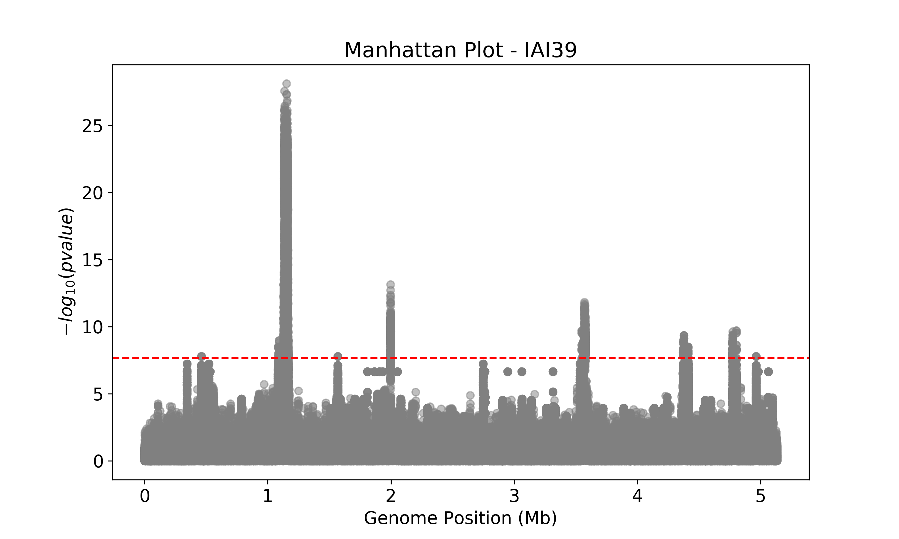
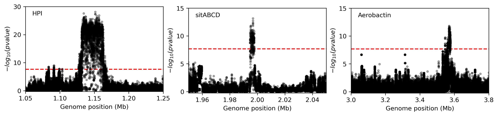
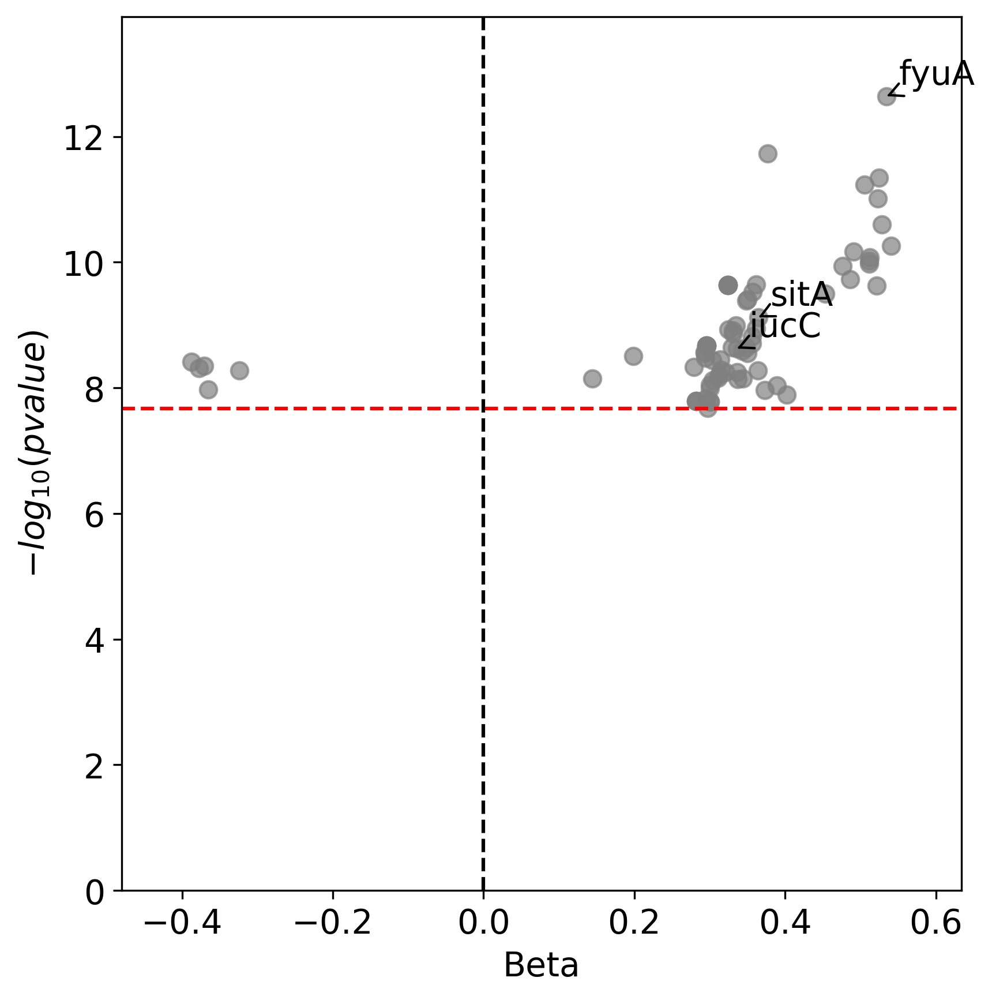
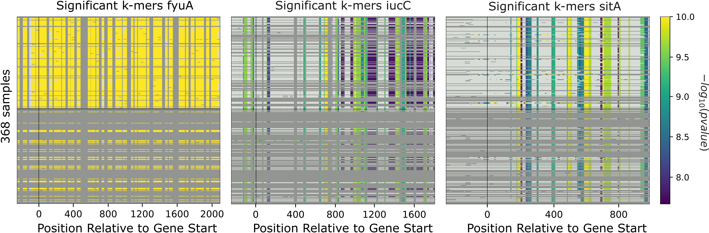
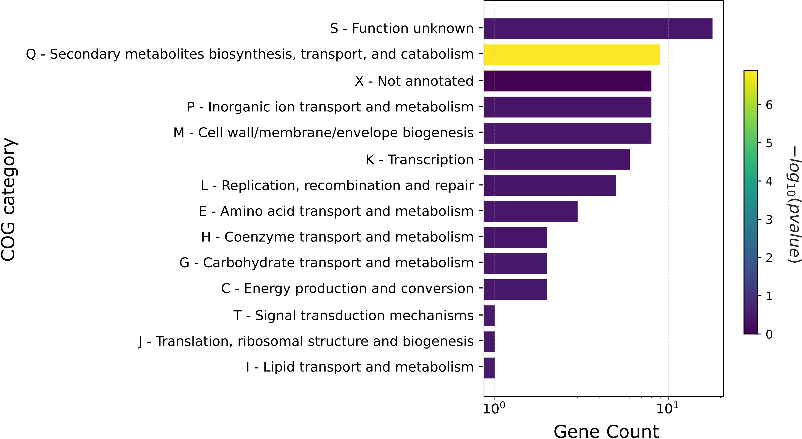

Beginner's guide
================

Genome-wide association study (GWAS) is a power test in bacterial genomics that allows one to identify genetic variants associated with a specific phenotype(s). 
This guide will walk you through conducting a comprehensive GWAS analysis on 370 *Escherichia coli* strains using the ``microGWAS`` pipeline. 
In the `study by Galardini et al. (2020) <https://journals.plos.org/plosgenetics/article?id=10.1371/journal.pgen.1009065>`_ , a mouse model of sepsis was used to characterize the virulence phenotype of the strains.
By following these steps, you will uncover genetic variants (unitigs, gene presence/absence, rare variants, gene cluster specific k-mers)  associated with the virulence phenotype in *Escherichia coli*.

Prerequisites
----------------
- Basic command-line knowledge
- Familiarity with genomic data 
- A computer with at least 10 GB RAM with 8 cores and operating on Linux OS
- Estimated time (*varies*)

1. Before you begin
--------------------

i. Install Conda (if NOT already installed):
^^^^^^^^^^^^^^^^^^^^^^^^^^^^^^^^^^^^^^^^^^^^

   If you don't have Conda installed, you can install it via Miniconda. Miniconda is a minimal installer for Conda.

   a. Download the Miniconda installer:

      .. code-block:: console

         wget https://repo.anaconda.com/miniconda/Miniconda3-latest-Linux-x86_64.sh -O miniconda.sh

   b. Install Miniconda:

      .. code-block:: console

         bash miniconda.sh -b -p $HOME/miniconda

   c. Initialize Conda:

      .. code-block:: console

         eval "$($HOME/miniconda/bin/conda shell.bash hook)"

   d. Verify the installation:

      .. code-block:: console

         conda --version

   You should see the Conda version printed to the console.

ii. Install mamba (if NOT already installed):
^^^^^^^^^^^^^^^^^^^^^^^^^^^^^^^^^^^^^^^^^^^^^^

After installing Conda, we recommend installing Mamba, a faster alternative to Conda for package management. 
Mamba is the recommended way of using Snakemake's conda integration.

   a. Install mamba in your base conda environment

      .. code-block:: console

         conda install -n base -c conda-forge mamba

   b. Verify the mamba installation 

      .. code-block:: console

         mamba --version
   
   You should see the mamba version printed to the console.

iii. Installing ``microGWAS``:
^^^^^^^^^^^^^^^^^^^^^^^^^^^^^^^
You can obtain the ``microGWAS`` repository by performing one of the following :

   a. Download the latest release from GitHub  (Recommended for most users)

   * Visit the `releases page <https://github.com/microbial-pangenomes-lab/microGWAS/releases>`_ on GitHub. 

   * Download the ``microGWAS.tar.gz`` file from the latest available release.
   
   * Unpack the downloaded file (``tar -xvf microGWAS.tar.gz``).

   * Navigate to the unpacked directory (``cd microGWAS``)

   b. Clone the repository (For advanced users)

   * Use ``Git`` to clone the repository and its submodules.

      .. code-block:: console

         git clone --recursive https://github.com/microbial-pangenomes-lab/microGWAS.git microGWAS
         cd microGWAS

   Note: The ``--recursive`` flag is used to clone any submodules that the repository might have.

   c. Create a new repository from template (For reproducible analysis):

   For this approach, you will need a GitHub account. It is ideal for when you plan on sharing your specific analysis as a reproducible code repository, including your phenotype file and other configurations.
   It also allows you to maintain your own version of the pipeline, including any specific configurations or modifications you make. 

   * Navigate to the ``microGWAS`` repository on `GitHub <https://github.com/microbial-pangenomes-lab/microGWAS>`_  and click on the green "Use this template" button and select "Create a new repository"

   * Once your new repository is created, clone it locally:

      .. code-block:: console
         
         git clone --recursive https://github.com/YOUR-USERNAME/YOUR-REPOSITORY-NAME.git 
         cd YOUR-REPOSITORY-NAME

   * Replace ``YOUR-USERNAME`` and ``YOUR-REPOSITORY-NAME`` with your GitHub username and the given name for your new repository, respectively. 

iv. Set up the ``microGWAS`` conda environment:
^^^^^^^^^^^^^^^^^^^^^^^^^^^^^^^^^^^^^^^^^^^^^^^

   Add the following channels:

   .. code-block:: console

      conda config --add channels defaults
      conda config --add channels bioconda
      conda config --add channels conda-forge  

   Now, create and activate the microGWAS conda environment:

   .. code-block:: console

      conda env create -f environment.yml
      conda activate microGWAS

v. Prepare your input data:
^^^^^^^^^^^^^^^^^^^^^^^^^^^^

a. Create a directory structure for your input files:

   .. code-block:: console

      mkdir -p data/gffs data/fastas

b. Download sample genomes in ``GFF`` format:

   .. code-block:: console
   
      wget -O data/gff.tar.gz https://figshare.com/ndownloader/files/34723351
   
   Extract GFF files:

   .. code-block:: console

      tar -xzvf data/gff.tar.gz --strip-components=1 -C data/gffs/

c. Download sample genomes in ``FASTA`` format:

   .. code-block:: console
   
      wget -O data/genomes.tgz https://figshare.com/ndownloader/files/21781689
   
   Extract genome FASTA files:

   .. code-block:: console

      tar -xzvf data/genomes.tgz -C data/fastas/

d. Download and modify the phenotype data:

      .. code-block:: console

         wget https://raw.githubusercontent.com/mgalardini/2018_ecoli_pathogenicity/master/data/phenotypes/phenotypes.tsv -O data/data.tsv
   
   This command will update your ``data/data.tsv`` file, adding the paths for fasta and gff files.

      .. code-block:: console

         awk 'BEGIN {OFS="\t"}
         
         NR==1 {print "strain", "fasta", "gff", "phenotype"}
         
         NR>1 {print $1, "data/fastas/" $1 ".fasta", "data/gffs/" $1 ".gff", $3}' data/data.tsv > temp_file &&
         
         mv temp_file data/data.tsv
      
e. Verify the updated phenotype file:

      .. code-block:: console

         head -n 5 data/data.tsv

      You should see an output similar to the example below. The first column lists the samples, the next two columns are the relative paths
      to the assembles in the fasta and gff formats, respectively. The last column represents the phenotype: where 1 indicates the strain is virulent, 
      while 0 indicates the strain is avirulent.

      .. code-block:: none

         strain  fasta   gff     phenotype
         ECOR-01 data/fastas/ECOR-01.fasta       data/gffs/ECOR-01.gff   0
         ECOR-02 data/fastas/ECOR-02.fasta       data/gffs/ECOR-02.gff   1
         ECOR-03 data/fastas/ECOR-03.fasta       data/gffs/ECOR-03.gff   0
         ECOR-04 data/fastas/ECOR-04.fasta       data/gffs/ECOR-04.gff   0

f. Clean up:
   
   Remove the compressed files, you do not need them anymore:

      .. code-block:: console

         rm data/gff.tar.gz data/genomes.tgz

g. Verify your directory structure:
   
  After executing the aforementioned steps, your directory structure should look something like this:

   .. code-block:: none

      data/
      ├── data.tsv
      ├──fastas/
      │   ├── genome1.fasta
      │   ├── genome2.fasta
      │   └── ...
      ├── gffs/
      │   ├── genome1.gff
      │   ├── genome2.gff
      │   └── ...

You can confirm by doing:

   .. code-block:: console

      ls data/

vi. Set up the environment and configure the pipeline:
^^^^^^^^^^^^^^^^^^^^^^^^^^^^^^^^^^^^^^^^^^^^^^^^^^^^^^^

a. Set up the eggnog-mapper database:

The ``microGWAS`` pipeline requires the eggnog database for functional annotation. You have two options:

i. If you have an existing eggnog database:
Create a symbolic link to your actual eggnog data directory. 

.. code-block:: console

   ln -s /fast-storage/miniconda3/envs/eggnog-mapper/lib/python3.9/site-packages/data/ data/eggnog-mapper

Remember  to replace ``/fast-storage/miniconda3/envs/eggnog-mapper/lib/python3.9/site-packages/data/`` with the actual path on your system.

ii. If you do not have the eggnog database:

Simply proceed to run the ``microGWAS`` pipeline. The pipeline will automatically download and setup the required eggnog database during its execution.

Note: Creating a symbolic link is only necessary if you're using an existing eggNOG database.

b. Configure the pipeline:

   Ensure that the  ``##### params #####`` section of the ``config/config.yaml`` file matches the print out below.

   .. code-block:: yaml

      targets: [
         "phenotype",
         #"phenotype2",
      ]
      
      # MLST scheme
      mlst_scheme: ecoli

      # references for association summaries and annotation
      summary_references: "--reference 536 --reference CFT073 --reference ED1a --reference IAI1 --reference IAI39 --reference K-12_substr._MG1655 --reference UMN026 --reference UTI89"
      annotation_references: "--focus-strain 536 --focus-strain CFT073 --focus-strain ED1a --focus-strain IAI1 --focus-strain IAI39 --focus-strain K-12_substr._MG1655 --focus-strain UMN026 --focus-strain UTI89"
      enrichment_reference: "IAI39"
      
      # species to be used for AMR and virulence predictions
      species_amr: "Escherichia"

   Note: These parameters are already configured by default for *Escherichia coli*. You can modify the parameters by uncommenting (removing the # sign).

2. Running the ``microGWAS`` pipeline
-------------------------------------

Run the bootsrapping script.

.. code-block:: console

    bash bootstrap.sh Escherichia coli IAI39 GCF_000013305.1,GCF_000007445.1,GCF_000026305.1,GCF_000026265.1,GCF_000026345.1,GCF_000005845.2,GCF_000026325.1,GCF_000013265.1 

This script populates the input files used for the analysis and downloads the relevant reference genomes necessary for annotating the hits for *Escherichia coli* and analyse the variants

To run the full analysis, use the following command.

.. code-block:: console

    snakemake -p annotate_summary find_amr_vag map_back manhattan_plots heritability enrichment_plots qq_plots tree --cores 24 --verbose --use-conda --conda-frontend mamba

This will:

- Run the GWAS analysis
- Generate a phylogenetic tree to view the evolutionary relationships between the strains.
- Annotate the GWAS results with biological and functional information.
- Identify antimicrobial resistant and virulence associated genes.
- Perform an enrichment analysis for the genes with the associated variants.
- Compute the heritability of the phenotype. 
- Generate visualization plots (qq plots, manhattan plots, and COG analysis results). 

Customizing your analysis
^^^^^^^^^^^^^^^^^^^^^^^^^^

You can specify which :doc:`rules` you want the pipeline to run. For example, to run the pipeline without generating a phylogenetic tree:

.. code-block:: console

    snakemake -p annotate_summary find_amr_vag map_back manhattan_plots heritability enrichment_plots qq_plots  --cores 24 --verbose --use-conda --conda-frontend mamba

This command runs all the same analyses as before, except for generating a phylogenetic tree. 

3. Understanding the results
-----------------------------
 
``microGWAS`` generates multiple output files and figures which can be accessed from the ``out/`` directory. For a detailed descripition of all the outputs, refer to :doc:`outputs` section of this documentation. 
For the purpose of this tutorial, we will focus on key results replicated from the  `Galardini et al. (2020) study <https://journals.plos.org/plosgenetics/article?id=10.1371/journal.pgen.1009065>`_

a. Unitig-based association analysis
^^^^^^^^^^^^^^^^^^^^^^^^^^^^^^^^^^^^
Unitigs are unique DNA sequences that serve as markers for genetic variation. ``microGWAS`` uses unitigs with a minimum allele frequency (MAF) of > 1%, and excludes those shorter than 30bp or with problematic mapping.

This Manhattan plot shows unitigs associated with virulence. Peaks above the red dashed line represent genomic regions strongly associated with  the virulence phenotype. 
These unitigs are related to three iron-uptake systems: the high-pathogenecity island (HPI), aerobactin, and the *sitABCD* operon.

For a closer look at specific genomic regions of interest related to virulence factors in *E. coli*, you can generate zoomed-in Manhattan plots.
The focus will be on three key areas: the high pathogencity island (HPI), the aerobactin siderophore system, and the *sitABCD* iron transport operon. 
To created these detailed plots, run the following command:

.. code-block:: console
   
   python3 workflow/scripts/manhattan_plots_zoomin.py -i out/associations/phenotype/mapped_all.tsv -o out/ -r "IAI39" -p out/associations/phenotype/unitigs_patterns.txt -z "HPI" 1.05 1.25 30 -z "sitABCD" 1.95 2.05 15 -z "Aerobactin" 3.2 3.8 15 -f png

The plot was generated for the "IAI39" reference genome, and the zoomed-in views were based on the genomic positions of the regions of interest.

You can also generate volcano plots to visualise the statiscal significance and magnitute of the effect for the tested genetic variants.
The following code will generate a volcano plots using the ``annotate_summary.tsv``.

.. code-block:: console

   python python3 workflow/scripts/volcanoplots.py annotated_summary.tsv out/volcano_unitigs --genes "fyuA" "sitA" "iucC" -p unitigs_patterns.txt --format png

This plot represents associations using unitigs as the genetic markers.

Each point represents a specific gene. The highlighted genes are those associated with the high pathogenecity island, the aerobactin, and the *sitABCD* operon.
The x-axis represents the average beta value (effect size), which indicates the magnitude and direction of the association between the unitigs and the virulence phenotye. Points on the right
indicate positive associations and those on the left indicate negative associations. The y-axis shows the statistical significance. The red dashed horizontal line indicates the signficance 
threshold computed using the ``unitigs_patterns.txt`` file.

Similar plots can be created using ``annotated_gpa_summary.tsv`` or ``annotated_panfeed_summary.tsv``. 
When using these alternative files, ensure you replace the ``-p`` argument with ``gpa_patterns.txt`` or ``panfeed_patterns.txt`` respectively in the command. 
This allows  for visualizatioin of results across different genetic markers (gene presence/absence, and gene cluser-speciic k-mers.)

b. Gene cluster-specific k-mer association analysis 
^^^^^^^^^^^^^^^^^^^^^^^^^^^^^^^^^^^^^^^^^^^^^^^^^^^
This analysis links specific k-mers are linked to their source genes.

These plots represent association  for gene cluster specific k-mers for *fyuA*, *iucC*, and *sitA* genes. The y-axis represents each isolate and the x-axis the k-mer positions relative to the gene start codon for each strain. 
The colors correspond to the -log10 of the association p-value. The dark gray regions imply that the isolates do not encode for the k-mers, while the light gray regions represent k-mers under the association threshold.

c. Functional Enrichment analysis
^^^^^^^^^^^^^^^^^^^^^^^^^^^^^^^^^^
This analysis identified overrepresented functional categories among genes with associated variants. 

*will have to update this figure to reflect the new color scheme*

The plot shows enrichment of clusters of orthologous groups (COG) categories. 
The y-axis of the plot represents each COG catergory, and x-axis the number of gene hits belonging to each category.The bars are colored based on the  -log10 of the enrichment corrected p-value.

4. Troubleshooting
-------------------

If you have persistent issues, please consult the ``Troubleshooting`` :doc:`usage` guide or seek help in the `project's issue tracker <https://github.com/microbial-pangenomes-lab/microGWAS/issues>`_.
